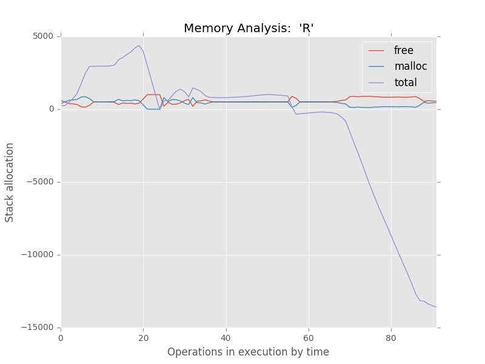

## Abstract

This project is about a special standalone of MAR whose try get a footprint of each program memory debug. The implementation is based on the core of [`mar`](https://gitlab.com/ryukinix/mar) as the lib to handle all the information.

## Getting Start

```
# deps, python package manager
sudo apt-get install python3-pip
sudo pip3 install setuptools
# project
sudo pip3 install git+https://gitlab.com/ryukinix/mar-footprint
```

## Command Line Interface
```
usage: footprint [-h] [-t TARGET] [-i INTERVAL] [--show-graph] [--save-graph]
                 csvs [csvs ...]

Read malloc-free pairs CSVs from debugmalloc program,do a sequence of stats
processing to processing data.On the final of processing, get a summarization
and put on new CSV.Beyond that, the user can choice by CLI to save or show
graphs. v0.5.2 Developed by Manoel Vilela on Federal University of Pará as
Student Researcher at 2016

positional arguments:
  csvs                  The list of pair malloc_0x.csv free_0x separated by
                        spaces or a dir

optional arguments:
  -h, --help            show this help message and exit
  -t TARGET, --target TARGET
                        The path (can be a folder name or path) to save the
                        output
  -i INTERVAL, --interval INTERVAL
                        The interval number to count longs on streaking rows
  --show-graph          Show the graph after pre-processing
  --save-graph          Save the graph on target after pre-processing

```

# Example


# Author

* Manoel Vilela